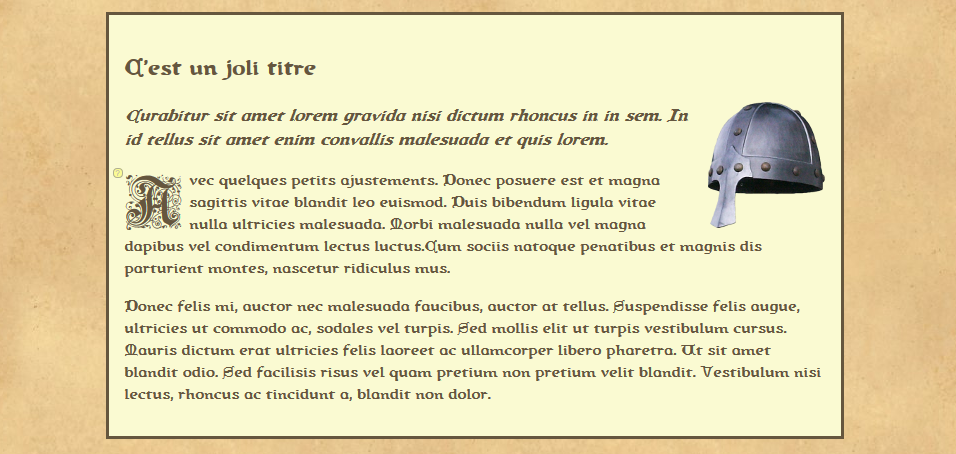
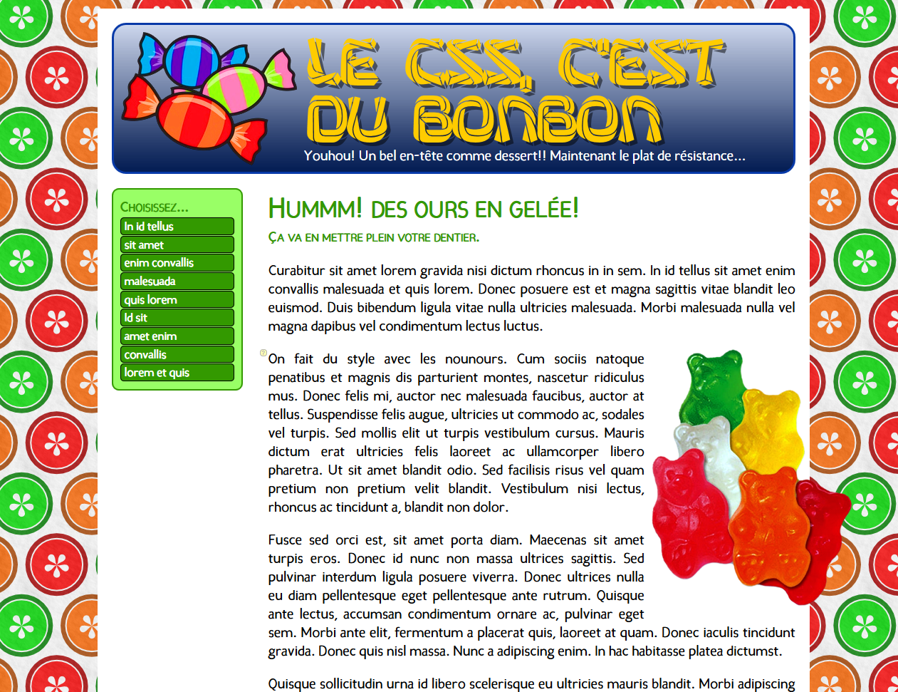

# Exercice : On ajoute du style
## Préparation

- Récupérer le dossier compressé <a href="https://github.com/web1cstj/dustyle/archive/refs/heads/depart.zip">dustyle-depart.zip</a> et le décompresser.
- Ouvrir le dossier `dustyle-depart` dans `VSCode`.

## Consignes

### Exercice 1 : "Le positionnement dans la page"

1. Visiter la [page de l'exercice](https://web1cstj.github.io/dustyle/casque.html)
2. Ouvrir le fichier `casque.html` dans `VSCode`.
3. Ouvrir également le fichier dans le fureteur afin de visualiser les changements.
4. Dans la balise ouvrante `<body>`, ajouter l'attribut style avec la valeur suivante : `font-family:queen_country; background-image:url(images/papier.jpg);`
5. Tester la page.
6. Dans la page de l'exercice, placer la souris sur certains éléments, et une bulle apparaîtra. La bulle contient les propriétés à ajouter à l'élément concerné.
7. Appliquer les styles aux balises correspondantes dans votre fichier.
   - La plupart du temps, on doit copier et coller le style d'un élément vers le suivant.
   - Parfois, on doit enlever une propriété. Elle est alors indiquée en rouge.

### Exercice 2 : Le CSS, c'est du bonbon

1. Visiter la [page de l'exercice](https://web1cstj.github.io/dustyle/bonbon.html)
2. Ouvrir le fichier `bonbon.html` dans `VSCode`.
3.  Ouvrir également le fichier dans le fureteur afin de visualiser les changements.
4.  Dans la balise ouvrante `<body>`, ajouter l'attribut style avec la valeur suivante : `background-image: url(images/agrumes.png); font-family: candela;font-size: 20px;`
5.  Tester la page.
6.  Dans la page de l'exercice, placer la souris sur certains éléments, et une bulle apparaîtra. La bulle contient les propriétés à ajouter à l'élément concerné.
7.  Appliquer les styles aux balises correspondantes dans votre fichier.
    - Parfois, on doit enlever une propriété. Elle est alors indiquée en rouge.

## Solution
Vous pouvez télécharger la solution complète ici : <a href="https://github.com/web1cstj/dustyle/archive/refs/heads/solution.zip">dustyle-solution.zip</a>
